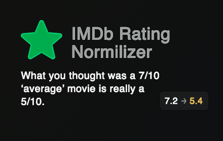
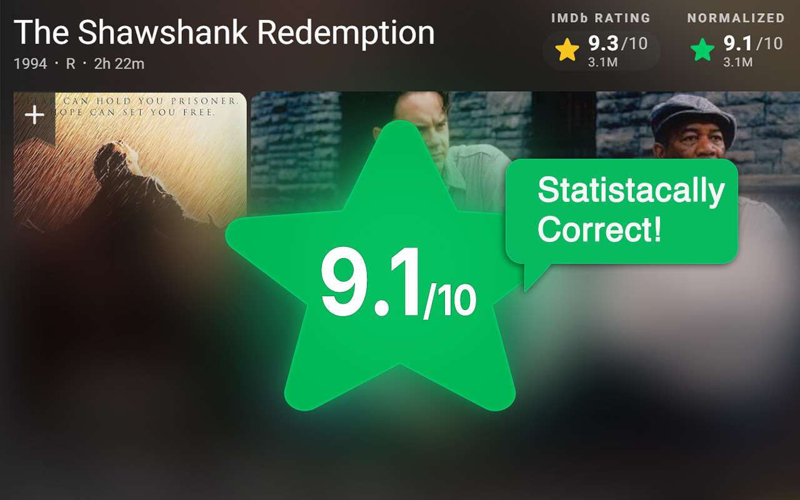
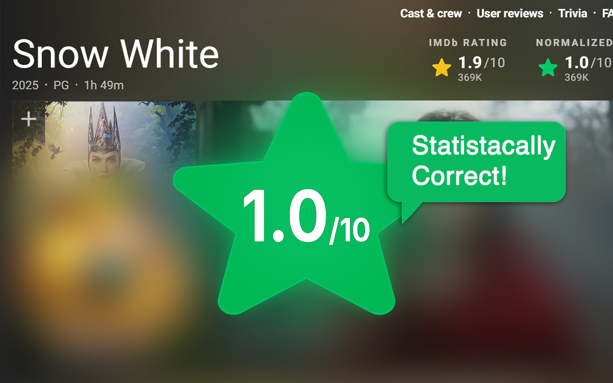
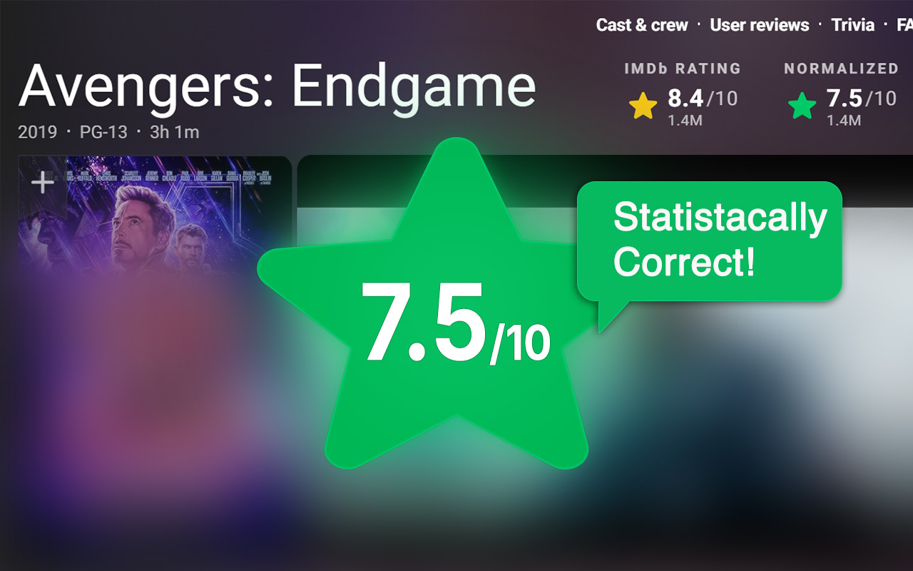

# IMDB Rating Normalizer

**What you thought was a 7/10 ‘average’ movie is really a 5/10.**

A Chrome extension that shows a normalized IMDB rating next to the official one, correcting for human rating biases.

## Motivation

People rarely use the full 1–10 scale.

- **Loss aversion** makes low scores feel stronger than high ones, so ratings cluster around 7–8, leaving 5 underused.  
- Most users treat 7/10 as “average” and 8/10 as “good,” skewing the mean to 7–8 instead of 5.5.

## Features

- **Instant display** of the normalized rating (1.0–10.0) on each movie page.  
- **Vote-count filter**: applies only to titles with at least 500 votes for accuracy.

## **Normalization Algorithm**

Uses a probability-integral transform followed by an inverse-normal mapping to recenter ratings at 5.5.

## Screenshots

